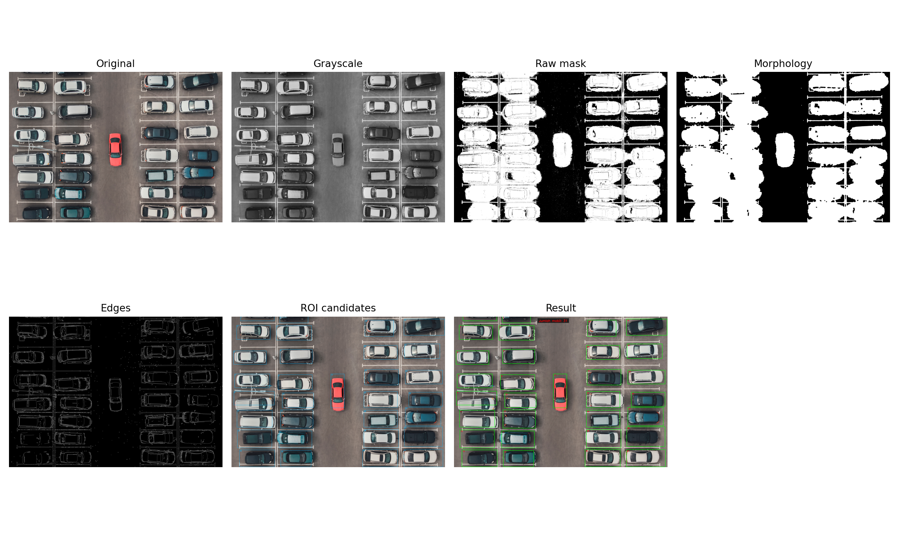
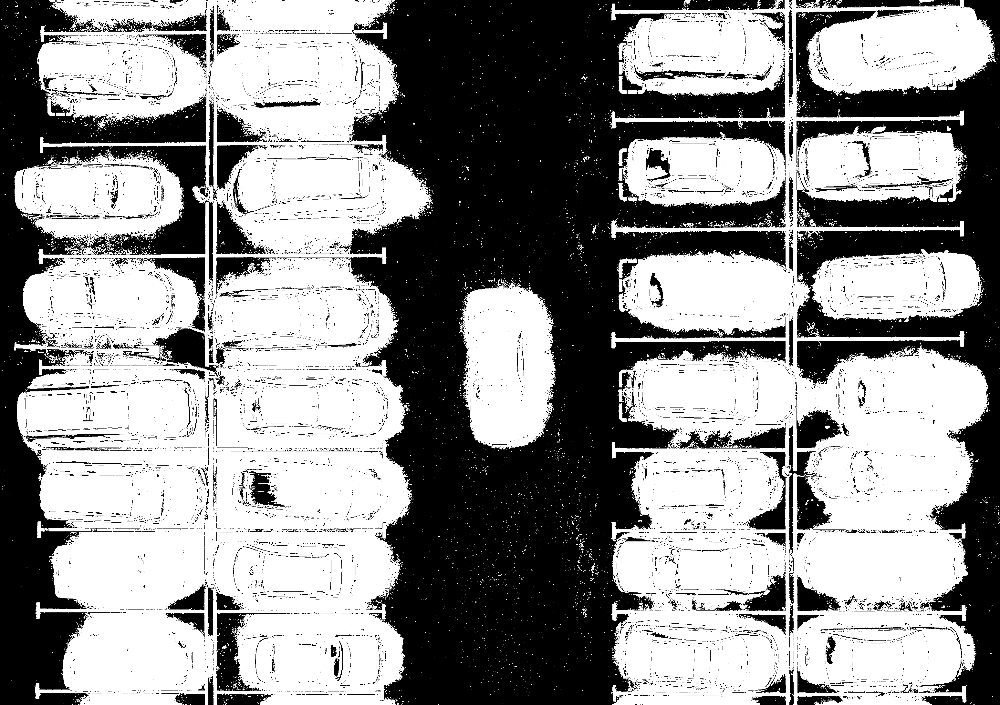
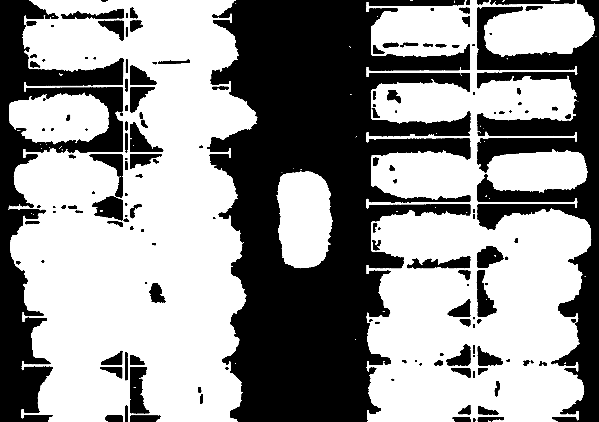
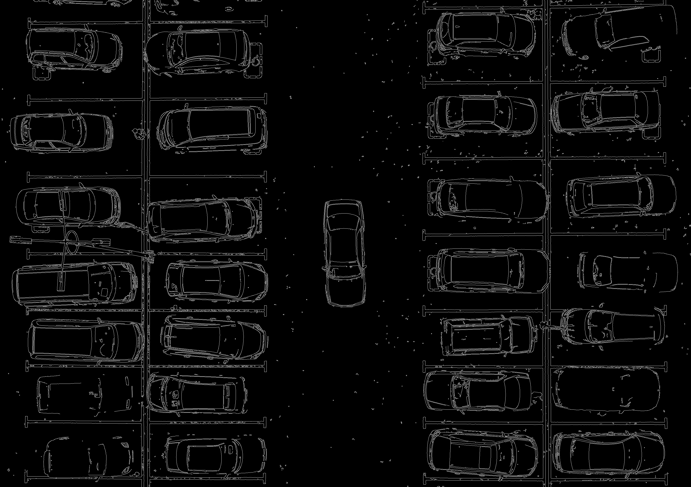

# Mini Project 2 - Object Counting

Repository ini dibuat untuk tugas Mini Project 2 mata kuliah Pengolahan Citra dan Video.
Program menghitung jumlah mobil pada foto aerial area parkir menggunakan teknik pengolahan citra klasik dengan OpenCV.

## Identitas

- Nama: Fito Dwi Ardiansah
- NRP: 5024241053

## Hasil Deteksi

- Jumlah mobil terdeteksi: **31 mobil**
- Output utama: `output/result.png`
- Ringkasan tahapan: `output/steps/pipeline_overview.png`

## Struktur Project

```text
mp2-object-counting/
|-- README.md
|-- counting.py
|-- input/
|   `-- parking.jpg
`-- output/
    |-- result.png
    `-- steps/
```

## Pipeline

Pendekatan yang digunakan adalah hybrid threshold-based, edge-based, dan ROI-assisted. ROI dipakai karena citra input adalah foto parkiran tetap dengan pola slot yang jelas. Dengan cara ini, garis marka parkir yang panjang dan tipis tidak ikut dihitung sebagai mobil.

1. Membaca citra dari `input/parking.jpg`.
2. Mengubah citra ke grayscale.
3. Mengubah citra ke HSV untuk memisahkan objek terang, gelap, dan berwarna dari latar aspal.
4. Membuat mask kandidat kendaraan dari kombinasi threshold HSV.
5. Membersihkan mask dengan operasi morfologi opening dan closing.
6. Membuat edge map dengan Canny untuk membantu mendeteksi tekstur/tepi kendaraan.
7. Menentukan ROI berdasarkan area slot parkir dan mobil tengah pada citra input.
8. Menghitung rasio piksel kandidat kendaraan dan kepadatan edge di tiap ROI.
9. ROI dihitung sebagai mobil jika rasio mask atau edge melewati ambang tertentu.
10. Menggambar bounding box pada ROI yang terdeteksi sebagai mobil.
11. Menyimpan visualisasi tiap tahap ke folder `output/steps/`.

## Visualisasi Tahapan

Program menyimpan beberapa citra antara:

- `output/steps/01_original.png`
- `output/steps/02_grayscale.png`
- `output/steps/03_raw_mask.png`
- `output/steps/04_morphology.png`
- `output/steps/05_edges.png`
- `output/steps/06_roi_candidates.png`
- `output/steps/pipeline_overview.png`

### Ringkasan Pipeline



### 1. Citra Original


### 2. Grayscale


### 3. Raw Mask HSV



### 4. Morphology



### 5. Edge Detection



### 6. ROI Candidates


### 7. Hasil Akhir


## Analisis

Metode ini tidak menggunakan deep learning atau model pre-trained, sehingga hasilnya sangat bergantung pada kualitas threshold dan penempatan ROI. Tantangan utama pada citra parkiran adalah:

- Marka parkir yang terang dapat ikut masuk ke mask kandidat.
- Bayangan pohon atau bangunan dapat membuat objek gelap palsu.
- Mobil dengan warna mirip aspal lebih sulit dipisahkan.
- Beberapa mobil berada di tepi gambar sehingga bounding box-nya hanya mencakup bagian yang terlihat.

Untuk meningkatkan akurasi, parameter seperti `occupancy_threshold` dan `min_edge_density` dapat disesuaikan di file `counting.py`. Jika ingin membuat metode lebih general untuk gambar parkiran lain, ROI bisa dibuat otomatis dari deteksi garis parkir menggunakan Hough Transform.

## Cara Menjalankan

1. Simpan gambar tugas sebagai:

```text
input/parking.jpg
```

2. Install library yang dibutuhkan:

```bash
pip install -r requirements.txt
```

3. Jalankan program:

```bash
python counting.py
```

Jika di Windows command `python` belum dikenali, coba:

```bash
py counting.py
```

4. Lihat hasil pada:

```text
output/result.png
output/steps/
```

Program juga akan mencetak jumlah mobil terdeteksi di terminal.
